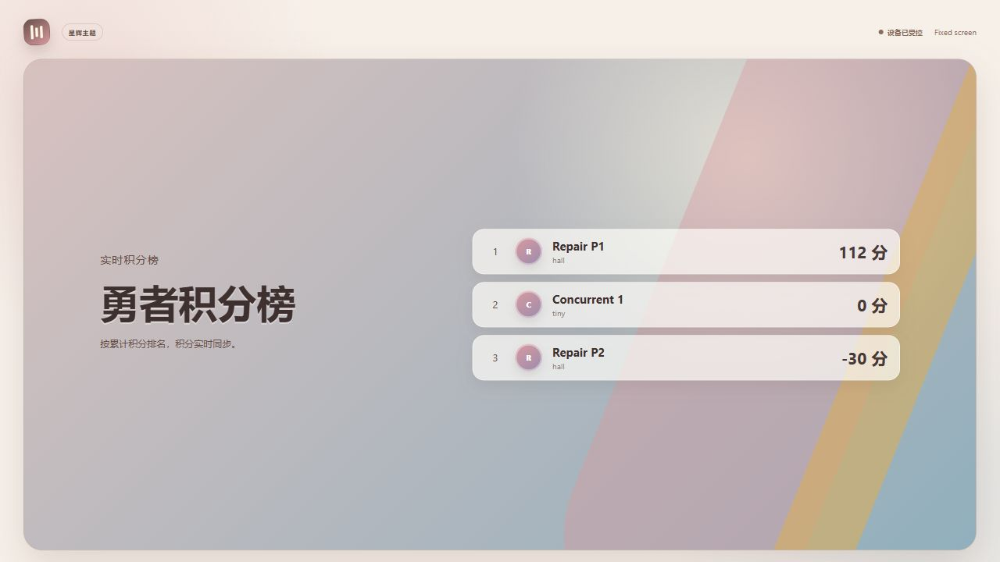

# Review 问题修复与验证（2026-10-01）

已修复 [原 review](REVIEW-2026-10-01.md) 的 12 项问题，并补充抽奖子活动订阅主活动事件及大屏配对令牌并发消费保护。

| 问题 | 修复 | 验证结果 |
| --- | --- | --- |
| F1 人工评分错计积分 | 待审核答案记 0；首次人工评分不扣减未入账的历史提议金额；后续评分按差额记账 | 人工给 100 分后总分 100；首次判错扣 20；重复评分不重复计分；重新评分与流水合计一致 |
| F2 并发登记超容量 | 登记和后台转会场对目标会场加数据库悲观锁 | PostgreSQL 容量 1，12 个并发请求仅 1 个 201，其余 11 个 409 |
| F3 暂停仍可答题 | PAUSED 拒绝答题 | 提交返回 409，自动化回归确认不生成提交与积分 |
| F4 人工评分漏统计 | 人工评分保存正确、部分正确或错误结果；统计兼容旧 SCORED 记录 | 满分人工评分后正确人数 1；新回归验证各分类合计等于提交数 |
| F5 大屏积分不刷新 | 积分/评分更新刷新已有设备快照与专属事件；保留布局、滚动及展示模式 | 不重发控场，API 大屏积分直接从 100 更新到 110；浏览器保持打开时收到实时改分并重排 |
| F6 排行人员误判为答对 | 累计积分榜只展示真实排名与累计分 | 浏览器显示正分、零分、负分，移除答对/答错分栏 |
| F7 内部素材地址不能访问 | 默认由 API 流式读取内部 S3；显式配置公开媒体域名时保留重定向 | MinIO 素材返回 200 且内容一致；Range 为 206，非法范围 416；无需解析 Docker 主机名 |
| F8 上传大小与错误响应 | Servlet 20 MiB 文件、21 MiB 请求；Nginx 21 MiB；超限响应 413；放行 ERROR dispatcher | 实际 2 MiB 上传 201，20 MiB + 1 字节上传 413；嵌入 Tomcat 测试覆盖文件与请求上限 |
| S1 活动管理员接管全局账户 | 活动范围编辑禁止系统管理员和跨活动共享账户；同一账户行锁避免授权检查竞态 | 实测密码重置 403，攻击者指定密码登录 401；回归验证独占活动账号仍可正常编辑 |
| S2 重放令牌撤销回滚 | 鉴权失败时保留重放检测的撤销提交 | R1 重放 401，R2 后续使用也为 401 |
| S3 并发刷新生成多会话 | 刷新前锁定稳定的所属账户，串行化整个令牌族的刷新、重放与注销 | PostgreSQL 3 个并发兑换为 200/401/401；回归覆盖重放与后继刷新竞争后无有效遗留令牌 |
| S4 注销后 WebSocket 仍投递 | CONNECT 保存会话身份；SUBSCRIBE 与每条 outbound MESSAGE 检查有效期、撤销、账号和当前权限；断开清理 | 实际 Redis/STOMP 正常订阅收到消息，HTTP 注销后不再收到新消息；另有真实嵌入 WebSocket 自动化回归 |

## 自动化与实际运行

- 前端 `npm test`：5 文件、19 项通过；`npm run build` 通过。
- 使用 Docker Nginx 执行 `nginx -t`，更新后的代理配置语法通过。
- Docker Java 21，`mvn test package`：15 个测试类、69 项，0 failures / 0 errors。新增/扩展测试覆盖计分、容量并发、暂停、设备同步、权限边界、刷新并发及重放、真实 multipart、S3 内容与 Range、WebSocket 撤销。
- 既有 Spring 测试使用 H2；另使用全新 PostgreSQL 16 / Redis 7 / MinIO 的隔离环境验证上述 HTTP、并发与真实 STOMP 流程。
- 已比较工作区与测试容器 122 个后端源/资源文件的 SHA-256，全部一致，避免验证过期副本。
- 浏览器验证修复后的设备配对与累计排行榜；保持页面打开时后台改分为 -30，页面自动显示负分并更新排名，没有重新发送控场或手动刷新。
- [实际响应记录](fix-evidence-2026-10-01.json)仅保存合成数据和状态，无 JWT、刷新 Cookie、签名地址或配对令牌。

## 兼容与运行说明

- 旧 PENDING_REVIEW 数据即使存有未入账的扣分，也按已入账 0 处理；旧 SCORED 记录仍能进入统计。
- 已经因旧版本产生的错误总分和流水不会被自动重写，需要核对原提交、评分与流水后由管理员调整，避免改写审计记录。本次未操作现有业务数据库。
- 内部媒体代理附带 nosniff 与 CSP sandbox，避免 SVG 直接打开时在 API 同源执行脚本。
- 配置非默认文件上限时，同步设置请求上限及反向代理上限，详见 [RUN.md](RUN.md)。
- WebSocket 撤销通过停止消息投递实现，原连接可能保持打开；令牌过期或权限撤销后同样拒绝投递。
- 原 review 的截图和响应保留作修复前证据；本文件记录修复后行为。未部署生产，也未进行现场规模压测或多实例容灾测试。
- 验证完成后清理本次临时 API、构建容器、PostgreSQL、Redis、MinIO 和网络；原有容器和数据保持原状。
