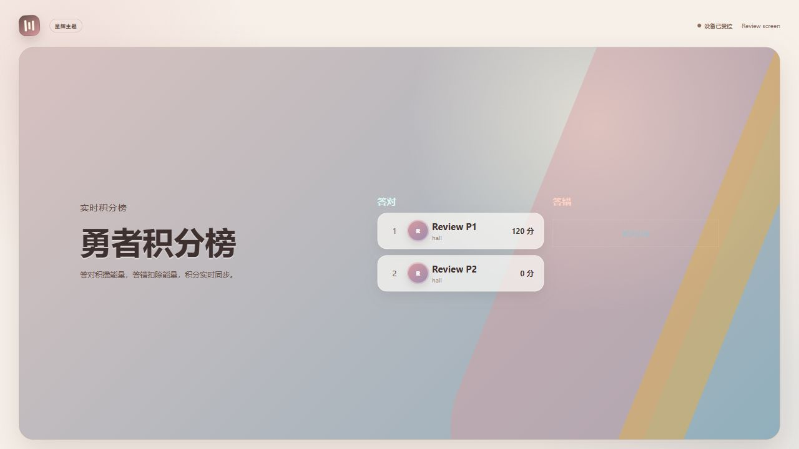

# 代码与实际运行 Review（2026-10-01）

先检查功能，再检查安全。使用三个子代理分别审查后端功能、前端功能、安全；主代理使用真实 PostgreSQL 16、Redis 7、MinIO 执行 HTTP、STOMP 和浏览器验证。发现 12 项可复现问题：3 项 P1，9 项 P2。没有修复或修改应用源码。

审查提交：`058989f3f7c8e7ab3c49b5b8cd6c871f9f5074b0`。

后续状态：本报告的 12 项问题已修复，修复后的验证见 [FIX-VERIFICATION-2026-10-01.md](FIX-VERIFICATION-2026-10-01.md)。下文保留修复前的事实与证据。

## 验证范围与环境

- 前端：`npm ci`、`npm test`（5 文件、19 项全部通过）、`npm run build` 通过。
- 后端：Docker 中 Java 21，`mvn test package`，11 类、51 项全部通过。既有测试使用默认 H2；实际 API 验证使用独立 PostgreSQL，不能把这 51 项称作 PostgreSQL 集成测试。
- API 使用 compose profile，PostgreSQL Flyway V1–V14 迁移成功，Redis 实时广播启用，MinIO 上传启用，健康检查 UP。
- 浏览器验证后台登录、活动总览、大屏管理、一次性配对及设备积分榜；实际 STOMP 连接验证 Redis 广播和注销后的订阅行为。
- 正向流程：登记、参与者令牌、开放题目、提交、人工评分、人工改分、创建奖池、发奖、核销成功，核销最终状态 REDEEMED。
- 本机原有中间件均停止，因此新建临时容器和空数据库；没有启动、改动原有中间件或其数据。使用 Vite 代理连接 API，没有启动生产 Nginx/OpenResty、域名或 TLS。
- 第一轮后端测试误继承 PostgreSQL URL 并使用默认 H2 driver，测试环境失败；清除这些测试环境变量后重新完整执行，51 项通过。该失败不计为产品缺陷。
- 原始响应：[review-evidence-2026-10-01.json](review-evidence-2026-10-01.json)。仅包含合成测试数据和状态，不包含登录 JWT、刷新 Cookie、签名下载链接或配对令牌。

## 功能问题

### F1 · P1 · 待审核文本题人工评分导致总分错误

位置：`server/src/main/java/com/matrixlive/service/ActivityService.java:540`、`:546`、`:569`。

复现：活动设置答错扣 20%，创建满分 100 的 MANUAL 文本题并开放；参与者提交后，接口返回 `awardedPoints=-20`、`totalScore=0`、`PENDING_REVIEW`。工作人员人工给 100 分后，排行榜总分变成 **120**，应为 100。

原因：待审核记录保存了尚未记账的扣分；人工评分把该值当作已记账分数，计算 `100 - (-20)`。判 0 分同样会漏扣分。修复应统一提交记录、积分流水和总分的记账语义，待审核首次评分不能扣减未入账金额。回归应覆盖扣分配置、首次人工评分、重复评分和重新评分。

### F2 · P2 · 并发登记突破会场容量

位置：`server/src/main/java/com/matrixlive/service/ActivityService.java:293`。

复现：创建容量 1 的会场，12 个不同联系方式同时登记；**9 个返回 201**、3 个返回 409。容量为 1 的会场实际登记了 9 人。

原因：普通计数查询与插入之间没有会场级锁或原子容量占用。不同参与者不触发同一业务唯一键冲突。修复应在一个事务内锁定会场后校验容量并登记，也应检查后台转会场路径中的同类逻辑。

### F3 · P2 · 活动暂停后仍允许提交答案

位置：`server/src/main/java/com/matrixlive/service/ActivityService.java:1121`。

复现：活动 LIVE、题目 QUESTION_OPEN 且倒计时未结束，将活动改为 PAUSED；使用正常参与者令牌提交答案仍返回 **200**，并新增提交记录。

原因：答题准入只禁止 FINISHED/CANCELLED，暂停不关闭开放题目。修复应明确暂停规则并让 API 执行该规则；当前抽奖准入已经禁止 PAUSED。

### F4 · P2 · 人工评分后控场答题分类漏计

位置：`server/src/main/java/com/matrixlive/domain/AnswerSubmission.java:95`、`server/src/main/java/com/matrixlive/service/ActivityService.java:627`。

复现：人工将唯一提交评为 100 分后，统计接口返回 `submittedCount=1`，但正确、部分正确、错误、待审核人数均为 **0**。

原因：人工评分统一写 SCORED，而分类统计只识别 CORRECT/PARTIAL/INCORRECT/PENDING_REVIEW。修复应保存正确性状态，或在统计中按统一的评分结果语义分类。

### F5 · P2 · 改分后大屏积分榜保持旧值

位置：`server/src/main/java/com/matrixlive/service/ActivityService.java:588`、`:667`；`src/App.jsx:6975`。

复现：发布积分榜时分数 120；人工加 10 分后，普通排行榜接口为 **130**，设备 state 仍为 **120**。浏览器配对后同样显示 120，重新发送 SCOREBOARD 控场才刷新。

原因：改分/评分只发活动事件；屏幕只订阅设备事件，设备数据是上次控场时的持久化快照。提交人数另有专用刷新逻辑，因此提交人数并不属于本问题。修复应在积分及人工评分提交后同步相关设备快照和设备事件；公布答案后的人工评分结果也应同步。

### F6 · P2 · 大屏把所有排行榜记录归为“答对”

位置：`src/App.jsx:6866`；`server/src/main/java/com/matrixlive/api/ApiModels.java` 的 ScoreboardEntry。

复现：用真实排行榜发布大屏，Review P2 为 **-30 分**，9 名并发登记人员未作答，全部在“答对”栏，答错栏显示“暂无记录”。浏览器 DOM 已确认；原始排行榜记录保存在 JSON 的 scoreboardClassification。

原因：接口只提供累计分和排名，没有题目正确性；前端把缺失状态默认判作正确。累计排行榜应直接展示累计排名；若需要按当前题答对/答错分栏，接口必须提供该题的实际答题结果，不能从累计分推断。

### F7 · P2 · 默认 Compose 上传素材无法从浏览器读取

位置：`docker-compose.yml:53`；`server/src/main/java/com/matrixlive/media/ObjectStorageService.java:128`。

复现：MinIO 上传小文件返回 201，访问稳定媒体 API 返回 302，Location 主机为 **ckm-review-minio:9000**。这是 Docker 内网名，普通宿主机浏览器无法解析。默认 Compose 同样设置 `S3_ENDPOINT=http://minio:9000`，未配置可供浏览器访问的媒体出口。

原因：用内部 S3 endpoint 生成签名下载地址后直接重定向浏览器。修复应提供双方可访问、正确签名的公开存储端点，或由 API 代理对象内容。不能仅替换签名 URL 的主机名，因为 Host 参与签名。

### F8 · P2 · 声明 20 MiB 上传限制，实际超过 1 MiB 即失败且返回鉴权错误

位置：`server/src/main/resources/application.yml:56`；`server/src/main/java/com/matrixlive/security/SecurityConfiguration.java:53`。

复现：带有效管理员 JWT 上传 **1,048,576 字节成功 201**，**1,048,577 字节返回 401**；2 MiB 同样 401。服务器日志明确为 `MaxUploadSizeExceededException`。

原因：只设置存储服务的 20 MiB 上限，没有设置 Servlet multipart 上限；错误分派又被鉴权规则拦截，掩盖了大小错误。修复应统一 Spring multipart、对象存储与代理上传上限，并让上传超限稳定返回 413。生产代理限制尚未运行验证。

## 安全问题

### S1 · P1 · 活动管理员可重置系统管理员密码并接管全站

位置：`server/src/main/java/com/matrixlive/security/auth/IdentityAdminService.java:52`、`:74`、`:80`。

使用隔离数据库中的新建测试账号验证，未重置原有 sysadmin：

1. 活动管理员直接 GET `/api/admin/users` 返回 **403**，确认其原本无系统权限。
2. GET `/api/activities/{id}/memberships/users` 返回 **200**，能枚举全局账户。
3. POST `/memberships` 把测试 SYSTEM_ADMIN 加为本活动 STAFF，返回 **201**。
4. PATCH `/memberships/users/{systemAdminId}` 设置攻击者指定密码，返回 **200**。
5. 用该密码登录返回 **200**，`systemRole=SYSTEM_ADMIN`。

原因：活动成员管理允许挂接任意全局账户，修改账户时只验证成员关系，不验证目标的全局权限或共享账户边界。修复应将活动成员关系管理与全局账户资料/凭证管理分离，禁止活动管理员通过该路径修改系统管理员或跨活动共享账户的密码。仅隐藏账户列表无法修复。

### S2 · P1 · 刷新令牌重放检测的撤销操作被回滚

位置：`server/src/main/java/com/matrixlive/security/auth/AuthService.java:74`。

复现：登录得到 R1；R1 换 R2 返回 **200**；重放 R1 返回 **401**；再次使用 R2 仍返回 **200**，本应因同族令牌已撤销而拒绝。

原因：`@Transactional` 方法先撤销族内令牌，再抛 RuntimeException 类型的 DomainException，撤销随事务回滚；审计使用 REQUIRES_NEW，仍保存“Refresh family revoked”，形成错误安全记录。修复应让重放时的撤销操作真正提交，再返回鉴权失败，并验证全部同族后继令牌失效。

### S3 · P2 · 同一个刷新令牌并发兑换产生多个成功会话

位置：`server/src/main/java/com/matrixlive/security/auth/AuthService.java:70`；`server/src/main/java/com/matrixlive/security/auth/RefreshTokenRepository.java`。

复现：同一登录所得刷新 Cookie 同时发送 3 个 `/auth/refresh` 请求，返回 **[200,200,200]**，均签发了会话，而非只有一个成功。

原因：读取和撤销没有行锁、乐观锁或原子消费条件。浏览器端刷新互斥不能保护直接 API 调用、不同客户端或泄露令牌。修复应在数据库层保证一次消费，并与重放撤销策略统一。大屏配对存在类似无锁结构，本次没有并发验证，因此不额外报为已证实缺陷。

### S4 · P2 · 注销后 WebSocket 订阅仍有效

位置：`server/src/main/java/com/matrixlive/security/StompJwtChannelInterceptor.java:60`。

复现：活动管理员连接 STOMP 并订阅活动主题；注销返回 **204**；旧 JWT 请求 `/auth/me` 返回 **401**；随后另一个管理员改分，原 WebSocket 仍收到 **score.adjusted**。

原因：令牌撤销检查只在 CONNECT 执行，既有订阅持续接收事件。修复应在注销、过期、账号禁用及授权撤销时终止或撤销相关订阅，或在发送阶段重新执行有效性与权限校验。此次直接证明注销场景，其他撤销场景仅作相同机制下的代码风险说明。

## 修复与验证建议

先修 S1、S2 和 F1，再修刷新并发、登记容量及实时屏幕同步。每项回归应覆盖上述实际失败场景；现有测试全部通过不能代表这些场景正确。

前端子代理还发现抽奖子活动页面读取主活动积分，却只订阅子活动事件，可能导致主活动积分不实时刷新；这是代码路径判断，本次未完整运行子活动场景，不计入 12 项实证问题。未进行现场规模压测、多实例容灾或生产部署验证。

审查完成后停止并删除本次新建的临时 API、PostgreSQL、Redis、MinIO 容器、临时网络、临时镜像及依赖缓存卷；原有容器保持原状态。测试原始响应和页面截图保留在本目录。
